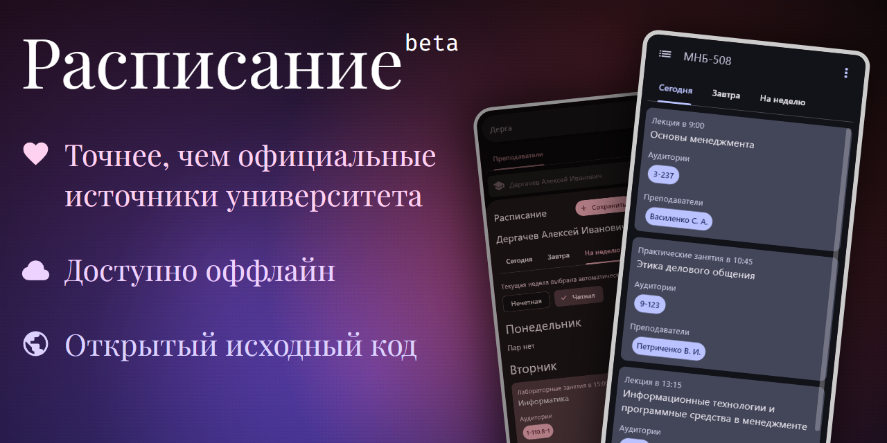

## Что это за проект
- Кроссплатформенное приложение нацелено на удобный доступ к расписанию вуза
- Точнее, чем официальные публичные источники расписания ВУЗа
- Четность недели выбирается автоматически, в отличии от оффициального публичного источника расписания ВУЗа
- Использует приватное API от одного из вузовского проекта, в котором состоит разработчик
- Доступно оффлайн и без регистрации
- _Мой "Hello world" в flet_
- Лицензия приложения `GNU GPL v3`, использование в коммерческих целях **запрещено**

## Запуск
### Установка
Склонируйте репозиторий, синхронизируйте `uv` командой ниже
```sh
uv sync 
```
Убедитесь, что используется `Python 3.13.9`

### Конфигурация
Перед началом работы нужно сконфигурировать проект. Для этого надо создать `src/config.py` и добавить необходимые переменные. Подробнее в `src/config.example.py`

### Локальный запуск
```sh 
# desktop
uv run flet run

# web
uv run flet run --web
```

### Компиляция
```sh
uv run flet build {platform}
```
Проверено на:

|  | Платформа | Версия |
|--|-----------|--------|
|✅|Android|`>= 13`
|❓|iOS (native)|
|❓|iOS (pwa)|
|✅|Web|`>= Chrome 142`
|✅|Windows|`>= 10`
|❓|MacOS|
|✅|Linux|`> 6.13`

_история коммитов удалена_